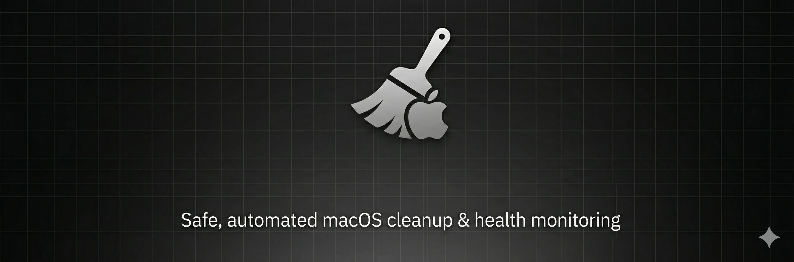

# fuck-cleanmymac 🧹



A comprehensive macOS system cleaner and health monitor toolkit designed to safely free up disk space, monitor system health, and provide automated maintenance.

## Features

### 🧹 **Cleaning (`cleaner.sh`)**
- **Safe path validation** - prevents accidental deletion of system directories
- **Dry-run mode** (`--dry-run`) - preview what will be deleted without actually deleting
- **Docker cleanup** - removes unused containers, images, and volumes
- **Package manager caches** - cleans npm, yarn, Homebrew, pip, gem caches
- **Application caches** - targets Cursor, Notion, Slack, Telegram, JetBrains IDEs
- **System maintenance** - cleans user caches, logs, and trash
- **Logging** - timestamped logs with automatic rotation (90 days retention)
- **Notifications** - displays system notifications when cleanup completes
- **Configuration file** - customize cleaning behavior via `cleaner.conf`

### 🏥 **Health Monitor (`health.sh`)**
- **System information** - displays Mac model, CPU, memory, OS version, uptime
- **Storage health** - shows SSD wear level, data written/read (via smartctl)
- **Battery status** - reports cycle count, capacity, health assessment, estimated lifespan
- **Memory usage** - detailed RAM breakdown (wired, active, inactive, free)
- **CPU load** - displays load average and top 5 CPU-consuming processes
- **Temperature monitoring** - CPU temperature (if tools available)
- **Network info** - local and external IP addresses
- **Security status** - Firewall, FileVault, System Integrity Protection status
- **System notifications** - sends summary to Notification Center

### ⚡ **Update Utility (`update.sh`)**
- **Homebrew updates** - upgrades installed packages
- **System updates** - checks and installs macOS updates
- **Self-updates** - optional check for script updates
- **Safe execution** - error handling and notifications

### 📊 **SwiftBar Plugin**
- Real-time system monitoring in macOS menu bar
- Quick access to cleaning and health check functions
- Automatic refresh (configurable interval)

## Installation

### Automatic Installation (Recommended)

The easiest way to install **fuck-cleanmymac** on macOS is using the auto-installation script:

#### One-liner Installation
```bash
curl -sL https://raw.githubusercontent.com/iposho/fuck-cleanmymac/main/install.sh | bash
```

This single command will:
- ✅ Clone the repository to `~/.scripts/fuck-cleanmymac`
- ✅ Create necessary directories (`~/.scripts`, `~/.config/fuck-cleanmymac`, `~/.scripts/logs`)
- ✅ Set up symlinks in `~/.scripts` for easy access
- ✅ Add scripts to your PATH (`.zshrc` or `.bashrc`)
- ✅ Copy configuration template to `~/.config/fuck-cleanmymac/cleaner.conf`
- ✅ Optionally install dependencies (smartmontools, osx-cpu-temp, mas)
- ✅ Optionally set up automatic weekly cleanup via cron
- ✅ Optionally install SwiftBar menu bar plugin

#### Non-Interactive Installation
If you prefer to skip interactive prompts, you can specify options:

```bash
./install.sh --skip-deps --skip-cron --skip-swiftbar
```

#### Available Installation Options
```bash
./install.sh                    # Interactive installation (recommended)
./install.sh --skip-deps        # Skip optional dependency installation
./install.sh --skip-cron        # Skip cron job setup
./install.sh --skip-swiftbar    # Skip SwiftBar plugin installation
./install.sh --uninstall        # Remove installation completely
./install.sh --help             # Show all available options
```

#### After Installation
Once installed, you can use the scripts from anywhere:

```bash
cleaner.sh                      # Run cleanup
cleaner.sh --dry-run            # Preview what will be cleaned
health.sh                       # Check system health
update.sh                       # Check for updates
```

#### Update Existing Installation
To update an existing installation:
```bash
cd ~/.scripts/fuck-cleanmymac
git pull origin main
```

Or reinstall:
```bash
curl -sL https://raw.githubusercontent.com/iposho/fuck-cleanmymac/main/install.sh | bash
```

---

### Manual Installation

If you prefer to set up manually or the auto-installer doesn't work for you:

#### 1. Clone the repository
```bash
git clone https://github.com/iposho/fuck-cleanmymac.git
cd fuck-cleanmymac
chmod +x cleaner.sh health.sh update.sh
```

#### 2. Optional: Add to PATH
```bash
mkdir -p ~/.scripts
cp cleaner.sh health.sh update.sh ~/.scripts/
export PATH="$HOME/.scripts:$PATH"
```

#### 3. SwiftBar Plugin (Optional)
```bash
# Create plugins directory if it doesn't exist
mkdir -p ~/Library/Application\ Support/SwiftBar/Plugins

# Copy the plugin
cp swiftbar/system-monitor.5s.py ~/Library/Application\ Support/SwiftBar/Plugins/
chmod +x ~/Library/Application\ Support/SwiftBar/Plugins/system-monitor.5s.py
```

## Usage

### Basic Cleaning
```bash
./cleaner.sh
```

### Dry-run Mode (Preview)
Preview what will be deleted without actually deleting:
```bash
./cleaner.sh --dry-run
```

### With Options
```bash
./cleaner.sh --dry-run --verbose    # Detailed preview
./cleaner.sh --no-notify             # Skip notifications
```

### Help
```bash
./cleaner.sh --help
```

### Health Check
```bash
./health.sh
```

### System Updates
```bash
./update.sh
```

## Configuration

### Config File Location
The script looks for configuration in this order:
1. `~/.config/fuck-cleanmymac/cleaner.conf`
2. `~/.scripts/cleaner.conf`
3. `./cleaner.conf` (project directory)

### Create Custom Config
```bash
mkdir -p ~/.config/fuck-cleanmymac
cp cleaner.conf ~/.config/fuck-cleanmymac/cleaner.conf
```

### Configuration Options
Edit the config file to customize:
- **LOG_DIR** - directory for log files (default: `~/.scripts/logs`)
- **LOG_RETENTION_DAYS** - auto-delete logs older than N days (default: 90)
- **CLEAN_DOCKER** - enable/disable Docker cleanup (default: true)
- **CLEAN_HOMEBREW** - enable/disable Homebrew cleanup (default: true)
- **CLEAN_NPM** - enable/disable npm cleanup (default: true)
- **CLEAN_YARN** - enable/disable yarn cleanup (default: true)
- **CLEAN_PIP** - enable/disable pip cleanup (default: true)
- **CLEAN_APP_CACHES** - enable/disable app-specific caches (default: true)
- **CLEAN_SYSTEM_CACHES** - enable/disable system caches (default: true)
- **CLEAN_TRASH** - enable/disable trash cleanup (default: true)
- **SHOW_NOTIFICATION** - enable/disable notifications (default: true)

### Example Config
```bash
# Enable dry-run by default
DRY_RUN=false

# Disable Docker cleanup
CLEAN_DOCKER=false

# Change log location
LOG_DIR="$HOME/Library/Logs/cleanmymac"

# Keep logs for 180 days instead of 90
LOG_RETENTION_DAYS=180
```

## Automation with Cron

### Weekly Cleanup (Every Sunday at 2 AM)
```bash
# Edit crontab
crontab -e

# Add this line:
0 2 * * 0 /Users/YOUR_USERNAME/.scripts/cleaner.sh --no-notify >> /Users/YOUR_USERNAME/.scripts/logs/cron.log 2>&1
```

### Daily Health Check (Every day at 8 AM)
```bash
0 8 * * * /Users/YOUR_USERNAME/.scripts/health.sh >> /Users/YOUR_USERNAME/.scripts/logs/health.log 2>&1
```

### Weekly System Updates (Every Monday at 3 AM)
```bash
0 3 * * 1 /Users/YOUR_USERNAME/.scripts/update.sh --no-notify >> /Users/YOUR_USERNAME/.scripts/logs/update.log 2>&1
```

## Safety Features

### Path Validation
- Prevents deletion outside user's home directory and `/Users/<user>`
- Blocks dangerous system paths: `/`, `/System`, `/usr`, `/bin`, `/sbin`, `/etc`, `/private`
- Validates all paths before deletion

### Dry-run Mode
- Preview exactly what will be deleted
- No files are actually modified
- Safe to test new configurations

### Logging
- Every cleanup operation is logged with timestamp
- Includes success/failure status for each action
- Auto-rotates old logs

### Pre-checks
- Validates directories exist before deletion
- Checks Docker daemon availability
- Confirms package managers are installed before running

## Logging

Logs are saved to: `~/.scripts/logs/cleaner_YYYYMMDD_HHMMSS.log`

View recent logs:
```bash
tail -f ~/.scripts/logs/cleaner_*.log
```

List all logs:
```bash
ls -lh ~/.scripts/logs/
```

## Troubleshooting

### Docker cleanup hangs
The script includes a 5-second timeout for Docker operations. If Docker is unresponsive, it will skip that step.

### Permission denied errors
Make sure scripts are executable:
```bash
chmod +x cleaner.sh health.sh update.sh
```

### Notification not showing
- Ensure `osascript` is available: `command -v osascript`
- Try running manually to see notification: `./cleaner.sh`

### Battery info not showing in health.sh
This is normal on desktop Macs without batteries. The script handles this gracefully.

### smartctl not found
To enable SSD monitoring:
```bash
brew install smartmontools
```

## Dependencies

### Required
- bash 4.0+
- macOS 10.12+
- Standard Unix utilities (find, grep, awk, sed)

### Optional
- `docker` - for Docker cleanup
- `brew` - for Homebrew cleanup
- `npm` / `yarn` - for JavaScript package manager cleanup
- `smartctl` - for SSD health monitoring (install via `brew install smartmontools`)
- `osx-cpu-temp` - for CPU temperature (install via `brew install osx-cpu-temp`)

## Performance Notes

- Full cleanup typically takes 5-30 seconds depending on system state
- Dry-run is slightly faster as it doesn't delete files
- Health check completes in 2-5 seconds
- SwiftBar plugin refreshes every 5 seconds

## Security Considerations

- Scripts validate all paths before deletion
- Config files are user-readable but may contain sensitive paths
- Logs contain information about system state and cleaned items
- Keep logs private or delete after review

## Contributing

Contributions are welcome! Please:
1. Test changes thoroughly
2. Preserve safety features
3. Update documentation
4. Follow bash best practices

## License

MIT License - feel free to use and modify

## Disclaimer

These scripts perform system maintenance operations. While extensive safety checks are implemented:
- Always run `--dry-run` first to preview changes
- Keep system backups
- Test in non-critical environments first
- Use at your own risk

## Support

For issues, questions, or suggestions:
1. Check troubleshooting section above
2. Review logs for detailed error information
3. Test with `--dry-run` mode
4. Open an issue with error logs

---

**Made with ❤️ for macOS users who want a cleaner system**
